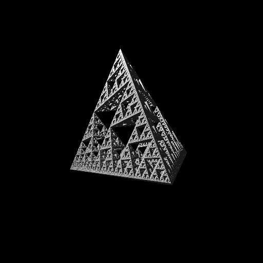

# Distance-Aided Ray Marching

Реализация Ray Marching для рендеринга 3D треугольника Серпинского с использованием модели освещения Ламберта.



## Сборка

Скачиваем зависимости:
```
git submodule init && git submodule update
```

Теперь можно собирать под CPU:
```
bash build_cpu.sh
```

Для сборки под GPU понадобится [kernel_slicer](https://github.com/Ray-Tracing-Systems/kernel_slicer). Перед сборкой нужно указать путь до него (единоразово).
```
bash setup.sh my/path/kernel_slicer/cmake-build-release/kslicer my/path/kernel_slicer

# собираем
bash build_gpu.sh
```
