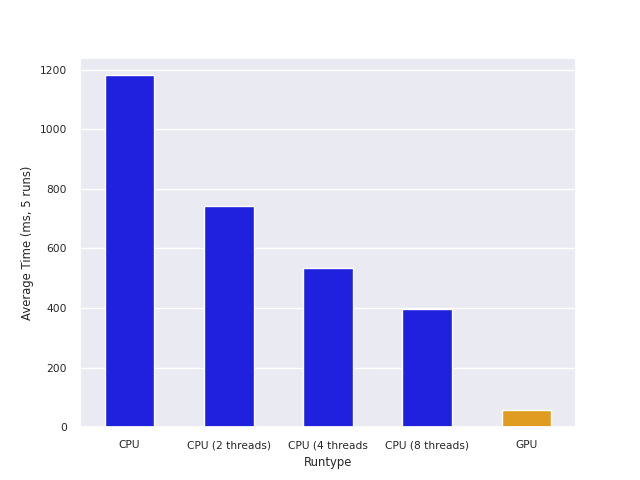

# Distance-Aided Ray Marching

Реализация Ray Marching для рендеринга 3D треугольника Серпинского с использованием модели освещения Ламберта.


## Интерфейс запуска, замеры времени

Запуск осуществляется из командной строки с единственным входным параметром — числом потоков для OpenMP (по умолчанию = 1). В случае сборки под GPU этот параметр ни на что не влияет.
```
# Запуск на CPU
$ ./cmake-build-release/testapp 6
n_threads = 6, onGPU = 0
timeRender = 290.334 ms, timeCopy = 0 ms 

# Пересобираем под GPU...

# Запуск на GPU
$ ./cmake-build-release/testapp
n_threads = 1, onGPU = 1
timeRender = 32.379 ms, timeCopy = 1.382 ms 
```

Результаты замеров:



## Сборка

Скачиваем зависимости:
```
git submodule init && git submodule update
```

Теперь можно собирать под CPU:
```
bash build_cpu.sh
```

Для сборки под GPU понадобится [kernel_slicer](https://github.com/Ray-Tracing-Systems/kernel_slicer). Перед сборкой нужно указать путь до него (единоразово).
```
bash setup.sh my/path/kernel_slicer/cmake-build-release/kslicer my/path/kernel_slicer

# собираем
bash build_gpu.sh
```

**Note**: между сборками под CPU и GPU нужно делать очистку сгенерированных файлов:
```
make clean
```

## Спецификация ПК

Сборка и запуск производились на машине со следующими версиями софта:
- OS: Ubuntu 20.04.6 LTS focal
- cmake version 3.16.3
- gcc version 9.4.0
- OpenMP 4.5
- Vulkan SDK 1.3.275

Железки:
- cpu: 11th Gen Intel(R) Core(TM) i7-1185G7 @ 3.00GHz
- graphics: VGA compatible controller: Intel Corporation Device 9a49 (rev 01)


